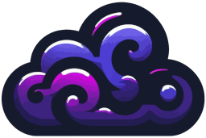

Made in Germany  with love ❤ and beer 🍺.

# ObsidianCloud
 
ObsidianCloud is a modern Minecraft Cloud orchestrator - lightweight like a cloud, robust like obsidian

## Requirements
- Java 17
- Windows/Linux

## Platforms:
||❌ Does not work|⚠ Not supported  but may work|✅ Supported|
|-|-|-|-|
|Bukkit, Spigot, Folia||All versions||
|Paper, Pufferfish, Pufferfish+, Purpur, Scissors, Grindstone||<1.20.4|1.20.4-1.21.1|
|Fabric, Quilt|*|||
|Forge|*|||
|NeoForge|*|||
|Minestom|*|||
|||||
|Bungeecord|||All versions|
|Velocity||<3.3.0|3.3.0-3.4.0|
|Gate|*|||

## Thanks to our contributors

